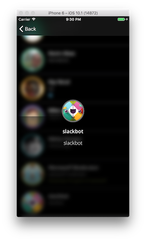

# SlackTeam
Uses the slack API to display a little info about your slack team.




## Slack API token

An **API token** is needed for this app to do anything. Visit [this link](https://api.slack.com/docs/oauth-test-tokens) if you need to create a token.

Enter the API token in the `SlackClient.swift` file.

The line looks like this

```
static let serverToken = "<SLACK API TOKEN HERE>"

```
# Links

[Slack token generator](https://api.slack.com/docs/oauth-test-tokens)


